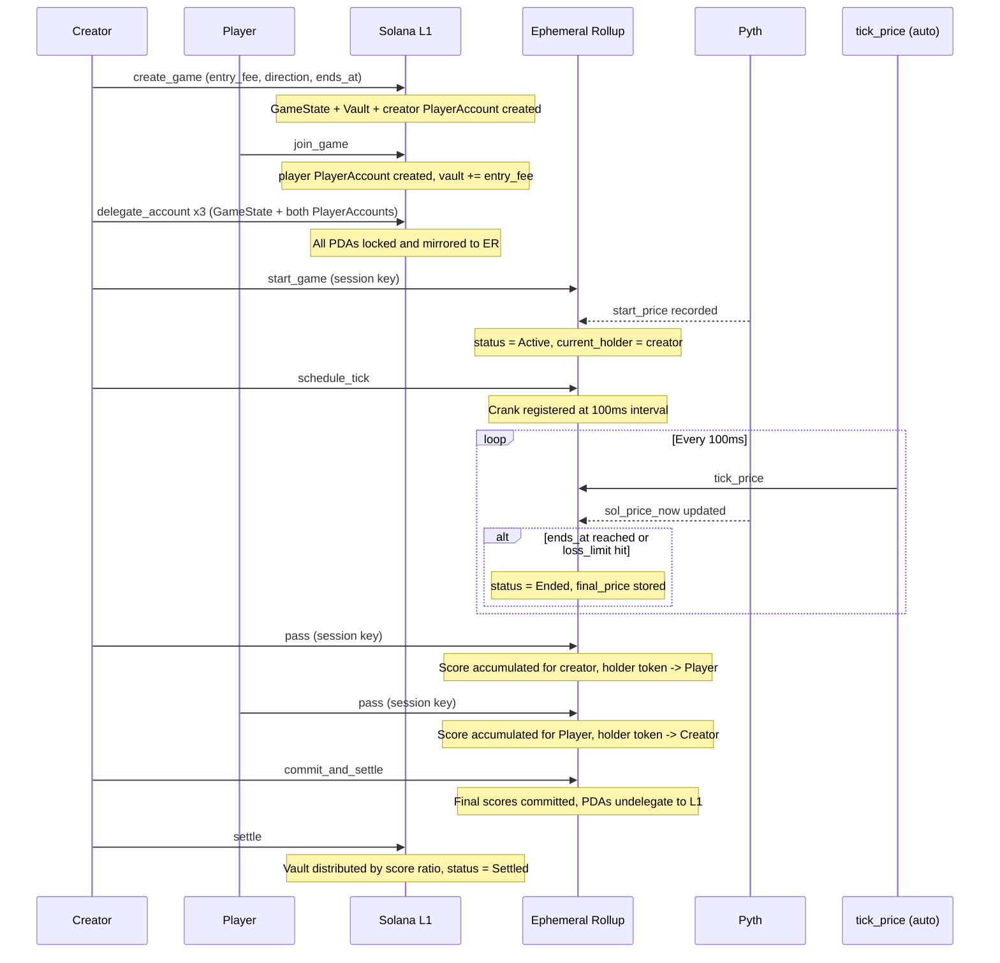
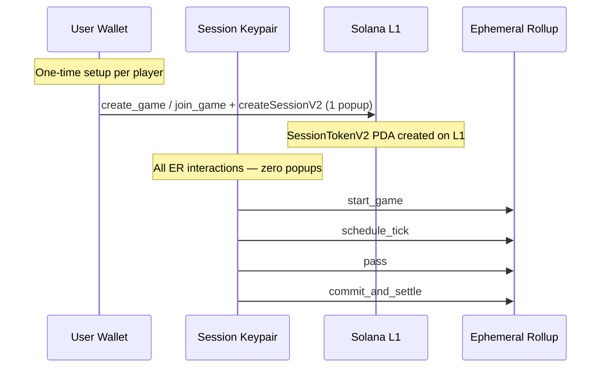
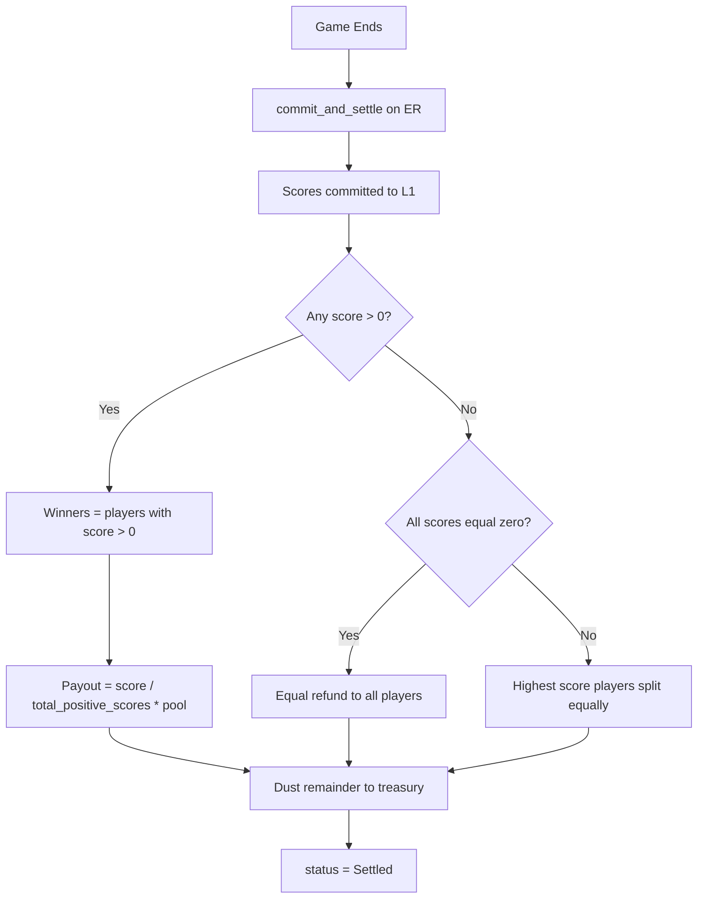
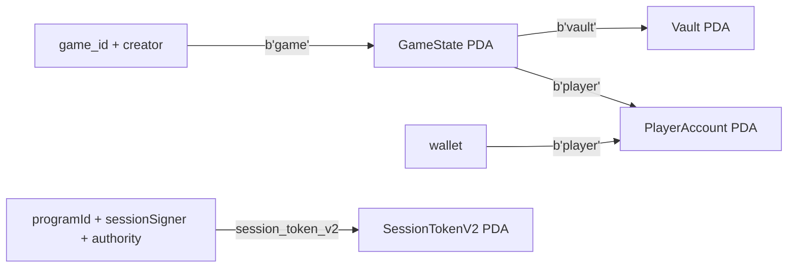
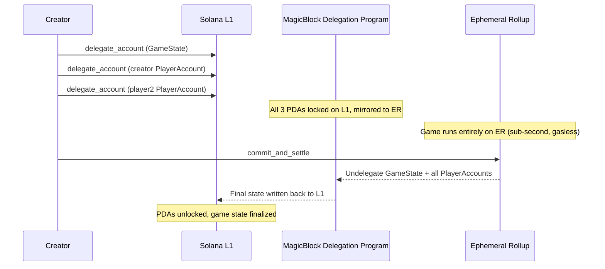

# FLOW — Architecture Diagrams

---

## Full Game Lifecycle

```mermaid
sequenceDiagram
    participant Creator
    participant Player
    participant L1 as Solana L1
    participant ER as Ephemeral Rollup
    participant Pyth
    participant Crank as tick_price (auto)

    Creator->>L1: create_game (entry_fee, direction, ends_at)
    Note over L1: GameState + Vault + creator PlayerAccount created

    Player->>L1: join_game
    Note over L1: player PlayerAccount created, vault += entry_fee

    Creator->>L1: delegate_account x3 (GameState + both PlayerAccounts)
    Note over L1: All PDAs locked and mirrored to ER

    Creator->>ER: start_game (session key)
    Pyth-->>ER: start_price recorded
    Note over ER: status = Active, current_holder = creator

    Creator->>ER: schedule_tick
    Note over ER: Crank registered at 100ms interval

    loop Every 100ms
        Crank->>ER: tick_price
        Pyth-->>ER: sol_price_now updated
        alt ends_at reached or loss_limit hit
            Note over ER: status = Ended, final_price stored
        end
    end

    Creator->>ER: pass (session key)
    Note over ER: Score accumulated for creator, holder token -> Player

    Player->>ER: pass (session key)
    Note over ER: Score accumulated for Player, holder token -> Creator

    Creator->>ER: commit_and_settle
    Note over ER: Final scores committed, PDAs undelegate to L1

    Creator->>L1: settle
    Note over L1: Vault distributed by score ratio, status = Settled
```

---

## Session Key Flow

```mermaid
sequenceDiagram
    participant Wallet as User Wallet
    participant Session as Session Keypair
    participant L1 as Solana L1
    participant ER as Ephemeral Rollup

    Note over Wallet: One-time setup per player
    Wallet->>L1: create_game / join_game + createSessionV2 (1 popup)
    Note over L1: SessionTokenV2 PDA created on L1

    Note over Session: All ER interactions — zero popups
    Session->>ER: start_game
    Session->>ER: schedule_tick
    Session->>ER: pass
    Session->>ER: commit_and_settle
```

---

## Score and Settlement Calculation

```mermaid
flowchart TD
    A[Game Ends] --> B[commit_and_settle on ER]
    B --> C[Scores committed to L1]
    C --> D{Any score > 0?}

    D -- Yes --> E[Winners = players with score > 0]
    E --> F[Payout = score / total_positive_scores * pool]

    D -- No --> G{All scores equal zero?}
    G -- Yes --> H[Equal refund to all players]
    G -- No --> I[Highest score players split equally]

    F --> J[Dust remainder to treasury]
    H --> J
    I --> J
    J --> K[status = Settled]
```

---

## PDA Derivation

```mermaid
flowchart LR
    A[game_id + creator] -->|b'game'| B[GameState PDA]
    B -->|b'vault'| C[Vault PDA]
    B & D[wallet] -->|b'player'| E[PlayerAccount PDA]
    F[programId + sessionSigner + authority] -->|session_token_v2| G[SessionTokenV2 PDA]
```

---

## Delegation and Undelegation

```mermaid
sequenceDiagram
    participant Creator
    participant L1 as Solana L1
    participant MB as MagicBlock Delegation Program
    participant ER as Ephemeral Rollup

    Creator->>L1: delegate_account (GameState)
    Creator->>L1: delegate_account (creator PlayerAccount)
    Creator->>L1: delegate_account (player2 PlayerAccount)
    Note over MB: All 3 PDAs locked on L1, mirrored to ER

    Note over ER: Game runs entirely on ER (sub-second, gasless)

    Creator->>ER: commit_and_settle
    ER-->>MB: Undelegate GameState + all PlayerAccounts
    MB-->>L1: Final state written back to L1
    Note over L1: PDAs unlocked, game state finalized
```
